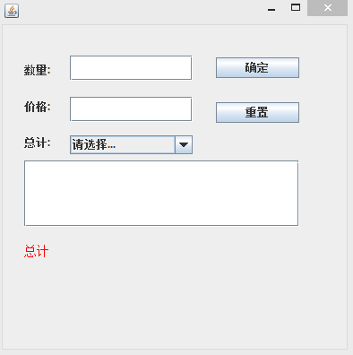
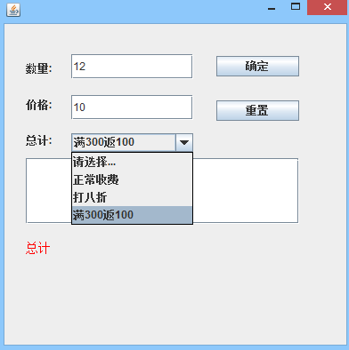
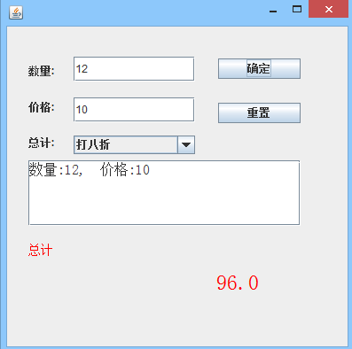

# Strategy

### GoF设计模式中的策略模式

#### 策略模式：又叫算法族模式，定义不同算法族，并且它们之间可以互相替换，让算法的变化独立于使用算法的客户。

##### 好处：可以动态改变对象的行为。

##### 具体描述：将每一个算法封装到具有共同接口的独立类中，从而使得它们可以相互替换。

##### 适用范围：当一个应用程序需要实现一种特定服务或者功能，且该程序的实现方法有多个。

#### 三个重要对象：
#### 环境对象：该类实现了对抽象策略中定义的接口或者抽象类的引用。
#### 抽象策略对象：由接口或抽象类实现。
#### 具体策略对象：封装了实现同功能不同的算法。

#### 基于以上几点，策略模式可避免由于使用条件语句而带来的代码婚礼，提高应用程序的灵活性。

#### 下面以一个超市的收银软件为例：
#### 运行图如下：
 
 
 

